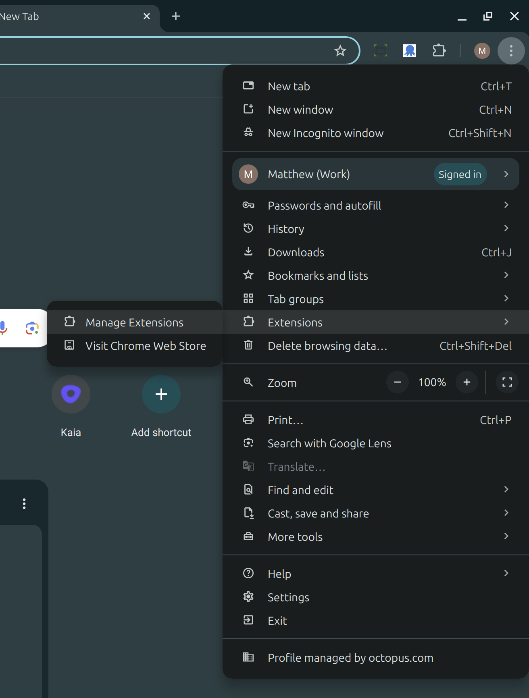
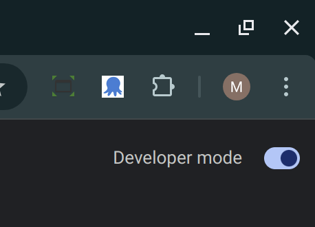
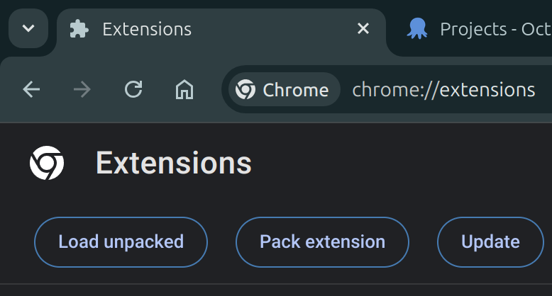
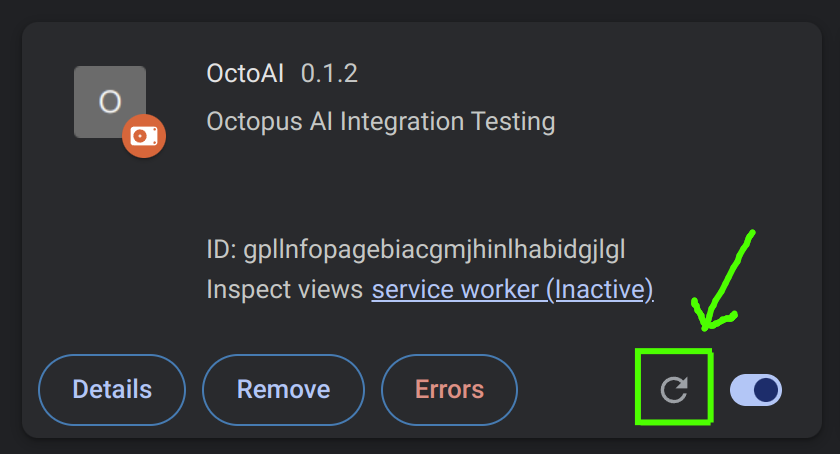

A Chrome extension used to prototype Octopus AI integrations.

# How to use

1. Click the vertical menu -> Extensions -> Manage Extensions


2. Enable developer mode



3. Click "Load unpacked" and select the folder where this repository is located



# How to contribute to the extension

1. Clone the repository

```bash
git clone https://github.com/OctopusSolutionsEngineering/OctoAIChromeExtension.git
```

2. Edit the style or functionality of the extension in the `content.js` file
3. Save your changes



# How to contribute new sample prompts

1. Add new sample prompts to the `prompts.json` file
2. Push the changes to the repository
3. The extension loads the new prompts automatically