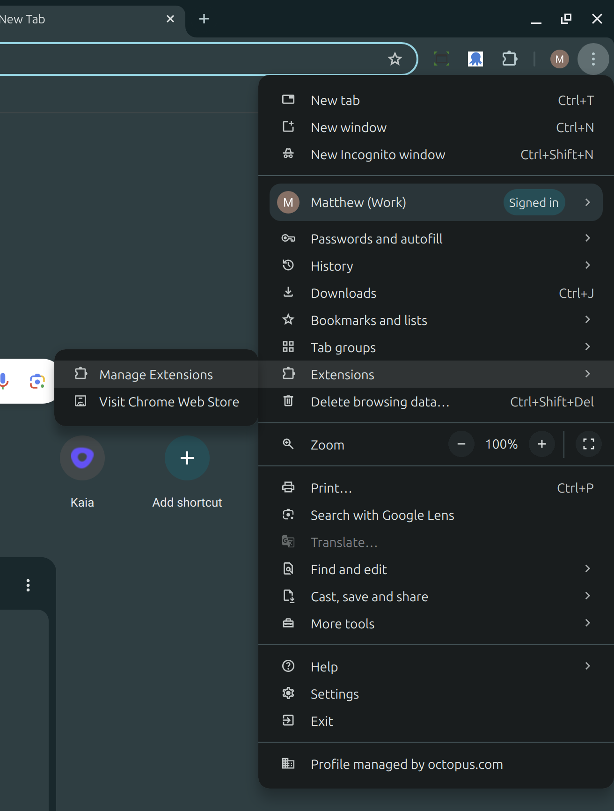
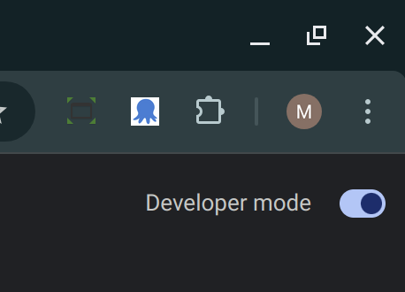
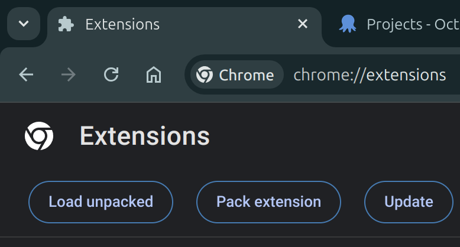
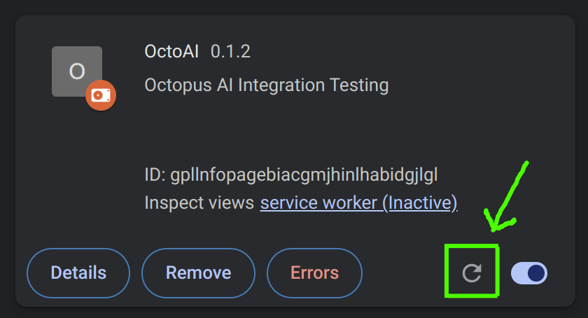

A Chrome extension used to integrate AI features into Octopus.

# How to use

1. Click the vertical menu -> Extensions -> Manage Extensions


2. Enable developer mode



3. Click "Load unpacked" and select the folder where this repository is located



# How to contribute to the extension

1. Clone the repository

```bash
git clone https://github.com/OctopusSolutionsEngineering/OctoAIChromeExtension.git
```

2. Edit the style or functionality of the extension in the `content.js` file
3. Click the reload button in the Chrome extensions page to apply the changes



# How to contribute new sample prompts

1. Add new sample prompts to the `promptsv#.json` file
2. Push the changes to the repository
3. The extension loads the new prompts automatically

# How to contribute new dashboards

See the [community dashboards documentation](dashboards/instructions.md).

# Analytics

The Value Metrics dashboard collects anonymous usage analytics (page views, button clicks, feature usage) to help improve the dashboard experience. No personally identifiable information, server URLs, or Octopus instance data is collected.

# How to update

1. Increment the `version` and `version_name` in the `manifest.json` file
2. Run the `createzip.sh` script to create a new zip file
3. Go to the [Developer Dashboard](https://chrome.google.com/webstore/devconsole/27323cfd-d379-4db4-8cfe-7ee8a5216900)
4. Log in with the `chrome-extensions@octopus.com` email address (credentials are in the secrets manager)
5. Open the `Octopus AI Assistant` extension
6. Select the `Package` tab
7. Click `Upload new package`
8. Upload the new zip file